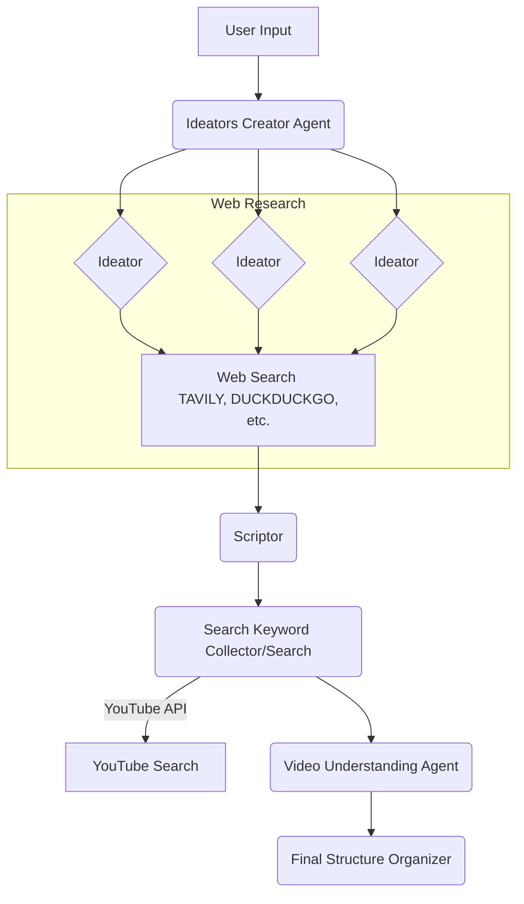

# System Architecture

This document outlines the architecture of the On-demand Short-form Clip Agent. The system is designed as a multi-agent workflow that takes a user-provided topic and generates a structured video plan, complete with a script and relevant video clips.

The architecture is implemented as a stateful graph using LangGraph, where each node in the graph represents a specific processing step performed by an AI agent or a tool.

## Architecture Diagram

## Workflow Components

The agent's workflow consists of the following sequential steps:

1.  **User Input**: The process begins with a topic provided by the user through the web interface.

2.  **Ideators Creator Agent (`create_ideators`)**: This agent receives the user's topic and dynamically creates a team of "Ideator" agents. Each ideator is assigned a unique persona to approach the research from different angles.

3.  **Ideator Agents (`conduct_research`)**:
    *   The ideators work in parallel to conduct research on the given topic based on their assigned personas.
    *   They use various web search tools like Tavily and DuckDuckGo to gather information.
    *   The output of this stage is a collection of research insights from multiple perspectives.

4.  **Scriptor Agent (`create_script`)**: The research insights from all ideators are passed to the Scriptor agent. This agent's primary role is to synthesize the gathered information into a coherent and engaging video script.

5.  **Search Keyword Collector/Search (`extract_keywords` & `search_youtube_api`)**:
    *   This component analyzes the generated script to extract relevant keywords.
    *   It then uses these keywords to query the YouTube API, searching for video clips that match the script's content.

6.  **Video Understanding Agent (`understand_youtube_videos`)**: The list of YouTube video URLs from the previous step is passed to this agent. It analyzes the content of these videos to determine their relevance and identify the most suitable segments.

7.  **Final Structure Organizer (`generate_final_structure`)**: This is the final step in the workflow. This agent takes the script and the analyzed video clips and organizes them into a final, structured video plan. This plan is then sent back to the frontend to be displayed to the user as a storyboard. 