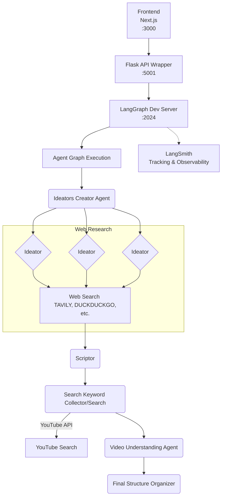

# ClipHunt Agent

This project is a web application that allows you to generate a video storyboard from a topic. It uses a sophisticated AI agent to research the topic, write a script, and find relevant YouTube clips.

[](https://www.youtube.com/watch?v=1rl1_QeESb8)

## Table of Contents

- [Project Structure](#project-structure)
- [Getting Started](#getting-started)
  - [Prerequisites](#prerequisites)
  - [Backend Setup](#backend-setup)
  - [Frontend Setup](#frontend-setup)
- [Usage](#usage)
- [Agent Workflow](#agent-workflow)
  - [Architecture Diagram](#architecture-diagram)
  - [Key Modules](#key-modules)
  - [Tool Integration](#tool-integration)
  - [Observability & Testing](#observability--testing)
  - [Known Limitations](#known-limitations)
- [API Endpoints](#api-endpoints)
  - [POST /generate-video](#post-generate-video)
  - [GET /health](#get-health)
- [Error Handling](#error-handling)
- [Backend Testing](#backend-testing)

## Project Structure

The project is divided into two main parts:

-   `vfront`: A [Next.js](https://nextjs.org/) application that provides the user interface.
    ```
    vfront/
    ├── app/               # Main application logic and routes
    │   ├── page.tsx       # Main page component
    │   └── layout.tsx     # Root layout
    ├── components/        # Reusable UI components
    │   └── ui/            # UI library components
    ├── lib/               # Utilities and helper functions
    │   └── utils.ts       # General utility functions
    ├── public/            # Static assets
    ├── package.json       # Project dependencies and scripts
    └── next.config.ts     # Next.js configuration
    ```
-   `backend`: A [Flask](https://flask.palletsprojects.com/) application that wraps the LangGraph dev server to enable LangSmith tracking.
    ```
    backend/
    ├── agent/             # AI agent workflow implementation
    │   ├── cliphunt.py    # Main workflow logic
    │   └── langgraph.json # LangGraph dev configuration
    ├── api_server.py      # Flask API wrapper for LangGraph dev
    ├── run_api.py         # Server startup script
    ├── test_api.py        # API testing script
    ```

## Getting Started

### Prerequisites

-   [Node.js](https://nodejs.org/) (v20 or later)
-   [Python](https://www.python.org/) (v3.12 or later)
-   `uv` (for Python package management)
-   `npm` (or `yarn` or `pnpm`)

### Backend Setup

1.  **Install dependencies and create virtual environment:**
    ```bash
    uv sync
    ```
    This will automatically create a virtual environment and install all dependencies from `pyproject.toml`.

2.  **Set up environment variables:**
    Copy `.env_example` to `.env` and fill in your API keys:
    ```bash
    cp .env_example .env
    ```
    Then edit `.env` with your API keys:
    ```
    GOOGLE_API_KEY=your_google_api_key
    TAVILY_API_KEY=your_tavily_api_key
    YOUTUBE_API_KEY=your_youtube_api_key
    LANGSMITH_PROJECT=your_project_name (optional)
    LANGSMITH_API_KEY=your_langsmith_api_key (optional)
    ```

3.  **Start the LangGraph dev server:**
    ```bash
    cd backend/agent
    uv run langgraph dev --port 2024
    ```
    This starts the LangGraph dev server at `http://localhost:2024` with LangSmith tracking enabled.

4.  **Run the API wrapper server:**
    Open a new terminal and run:
    ```bash
    uv run backend/run_api.py
    ```
    The Flask API wrapper will be running at `http://localhost:5001` and will forward requests to the LangGraph dev server.

### Frontend Setup

1.  **Navigate to the frontend directory:**
    ```bash
    cd vfront
    ```

2.  **Install the Node.js dependencies:**
    ```bash
    npm install
    ```

3.  **Run the frontend development server:**
    ```bash
    npm run dev
    ```
    The frontend application will be running at `http://localhost:3000`.

## Usage

1.  Make sure all three servers are running:
    - LangGraph dev server on port 2024
    - Flask API wrapper on port 5001
    - Frontend development server on port 3000
2.  Open your browser and navigate to `http://localhost:3000`.
3.  Enter a topic in the input field and click "Generate Video Plan".
4.  The application will then display a video storyboard with clips from YouTube.
5.  All agent executions will be tracked in LangSmith for debugging and observability.

## Agent Workflow

The system is designed as a multi-agent workflow that takes a user-provided topic and generates a structured video plan, complete with a script and relevant video clips. The architecture is implemented as a stateful graph using LangGraph, where each node represents a specific processing step performed by an AI agent or tool.

**Architecture Overview:**
- **Frontend** (Next.js) → **Flask API Wrapper** (Port 5001) → **LangGraph Dev Server** (Port 2024) → **Agent Graph Execution**
- The Flask API wrapper enables seamless LangSmith tracking while maintaining the same input/output interface
- All agent executions are automatically traced and logged in LangSmith for debugging and observability

### Architecture Diagram



The agent follows a structured workflow orchestrated by `langgraph` to generate a video plan from a given topic. The workflow consists of the following sequential steps:

1.  **User Input**: The process begins when a user submits a topic through the frontend. The Flask API wrapper receives this topic via a POST request to the `/generate-video` endpoint, then forwards it to the LangGraph dev server for execution with automatic LangSmith tracking.

2.  **Ideators Creator Agent (`create_ideators`)**: This agent receives the user's topic and dynamically creates a team of "Ideator" agents. Each ideator is assigned a unique persona to approach the research from different angles, ensuring a diverse range of ideas.

3.  **Ideator Agents (`conduct_research`)**: The ideators work in parallel to conduct research on the given topic based on their assigned personas. They use various web search tools like Tavily and DuckDuckGo to gather relevant information and identify compelling narratives and media sources. The output is a collection of research insights from multiple perspectives.

4.  **Scriptor Agent (`create_script`)**: The research insights from all ideators are passed to the Scriptor agent. This specialized agent synthesizes the gathered information into a coherent and engaging video script, outlining scenes, dialogue, and visual cues.

5.  **Search Keyword Collector/Search (`extract_keywords` & `search_youtube_api`)**: This component analyzes the generated script to extract relevant keywords, then uses these keywords to query the YouTube API, searching for video clips that match the script's content.

6.  **Video Understanding Agent (`understand_youtube_videos`)**: The list of YouTube video URLs from the previous step is passed to this agent. It analyzes the content of these videos to determine their relevance and identify the most suitable segments.

7.  **Final Structure Organizer (`generate_final_structure`)**: This is the final step in the workflow. This agent takes the script and the analyzed video clips and organizes them into a final, structured video plan. The plan is then returned to the frontend as a JSON object to be displayed as an interactive storyboard.

### Key Modules

-   **API Wrapper (`api_server.py`)**: A Flask application that wraps the LangGraph dev server, enabling LangSmith tracking while maintaining the same input/output interface. It creates threads and forwards streaming requests to the LangGraph dev API.

-   **Planner (`cliphunt.py`)**: The overall plan is defined by the `langgraph` `StateGraph`. This graph breaks down the high-level goal of generating a video into a series of sub-tasks represented by nodes (e.g., `create_ideators`, `conduct_research`). This serves as the agent's planner.

-   **Executor (`cliphunt.py`)**: The execution logic resides in the functions mapped to the planner's nodes. These functions call LLMs, search tools, and other utilities to perform their tasks. The core execution flow includes:
    -   `create_ideators`: Generates AI personas for brainstorming.
    -   `conduct_research`: Each persona searches the web for information.
    -   `create_scriptor`: Creates an AI persona specialized in scriptwriting.
    -   `create_script`: Generates the video script.
    -   `extract_keywords`: Pulls keywords from the script for media search.
    -   `search_youtube_api`: Searches YouTube for relevant video clips.
    -   `understand_youtube_videos`: Analyzes the content of the found videos.
    -   `parse_video_analysis`: Parses the analysis into a structured format.
    -   `generate_final_structure`: Assembles the final video plan.

-   **Memory & State (`cliphunt.py`)**: The agent's state is managed by the `GeneratedIdeatorState` TypedDict, which is passed between each node. LangSmith automatically tracks and traces the entire workflow execution when running through the LangGraph dev server. The state contains the following fields:
    -   `topic`: The initial user-provided topic.
    -   `max_ideators`: The number of ideator personas to generate.
    -   `ideators`: A list of the generated `Ideator` objects.
    -   `research_results`: The collected research from the ideators.
    -   `scriptor`: The generated `Scriptor` persona.
    -   `final_script`: The generated `VideoScript` object. This is a crucial piece of state that informs subsequent steps.
    -   `keyword_extraction`: The keywords extracted from the script, which drive the content search.
    -   `content_search_results`: The results from the content search.
    -   `video_understanding_results`: The analysis of the YouTube videos.
    -   `parsed_video_analysis`: The parsed and structured video analysis.
    -   `final_video_structure`: The final, complete video plan that is returned to the user. This is the ultimate output of the agent.

### Tool Integration

The agent integrates several external tools and APIs:

-   **LLM (Google Gemini)**: Used for generating personas, writing scripts, and analyzing content. It is accessed via the `langchain_google_genai` and `google.generativeai` libraries.

-   **Tavily Search**: A search API used by the ideator agents to conduct research. It is accessed via the `tavily-python` library.

-   **DuckDuckGo Search**: An alternative search tool for research.

-   **YouTube API**: Used to search for and retrieve information about YouTube videos, which are then integrated into the video plan. It is accessed via the `google-api-python-client` library.

### Observability & Testing

-   **LangSmith**: The agent's execution is automatically tracked using LangSmith when running through the LangGraph dev server, providing detailed tracing, debugging, and performance monitoring of the agent's behavior.
-   **LangGraph Dev UI**: Access the LangGraph development interface at `http://localhost:2024` for real-time monitoring and debugging.
-   **Logging**: The application uses standard Python `print` statements for logging, which are visible in both the Flask API wrapper and LangGraph dev server consoles.
-   **API Testing**: The `test_api.py` file contains a suite of tests for the Flask API wrapper, ensuring that the endpoints are functioning correctly.

## API Endpoints

The Flask API wrapper provides the following endpoints that forward requests to the LangGraph dev server:

### POST /generate-video
Generate a video structure from a topic via the LangGraph dev server (with LangSmith tracking).

**Request Body:**
```json
{
  "topic": "your topic here",
  "max_ideators": 1  // optional, defaults to 1
}
```

**Example Request:**
```bash
curl -X POST http://localhost:5001/generate-video \
  -H "Content-Type: application/json" \
  -d '{"topic": "lebron james and the lakers"}'
```

**Success Response (200):**
```json
{
  "title": "Video Title",
  "goal": "Video goal and purpose",
  "style": ["informative", "engaging", "dynamic"],
  "segments": [
    {
      "time_range": "[0-5 seconds]",
      "title": "Segment title",
      "visual": [
        {
          "sub_time_range": "00:07",
          "type": "clip",
          "source": "https://youtube.com/watch?v=...",
          "description": "Visual description"
        }
      ],
      "audio": "Audio description"
    }
  ]
}
```

### GET /health
Health check endpoint.

**Success Response (200):**
```json
{
  "status": "healthy",
  "message": "Video generation API is running"
}
```

## Error Handling

The API returns appropriate HTTP status codes and error messages.

- `400 Bad Request`: If the `topic` is missing from the request body.
- `500 Internal Server Error`: For any other server-side errors.

**Error Response:**
```json
{
  "error": "Error description"
}
```

## Backend Testing

To test the complete setup:

1. **Start the LangGraph dev server:**
   ```bash
   cd backend/agent
   uv run langgraph dev --port 2024
   ```

2. **Start the Flask API wrapper:**
   ```bash
   cd backend
   uv run python run_api.py
   ```

3. **Run the test script:**
   ```bash
   cd backend
   python test_api.py
   ```

This will test the full pipeline: Flask API wrapper → LangGraph dev server → Agent execution with LangSmith tracking.